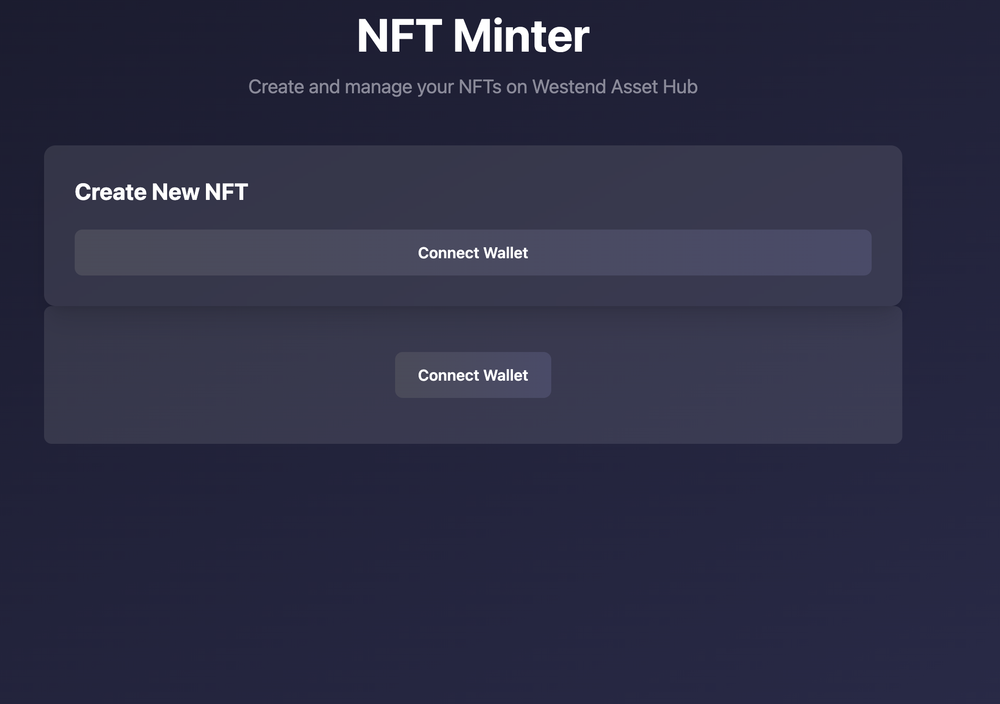
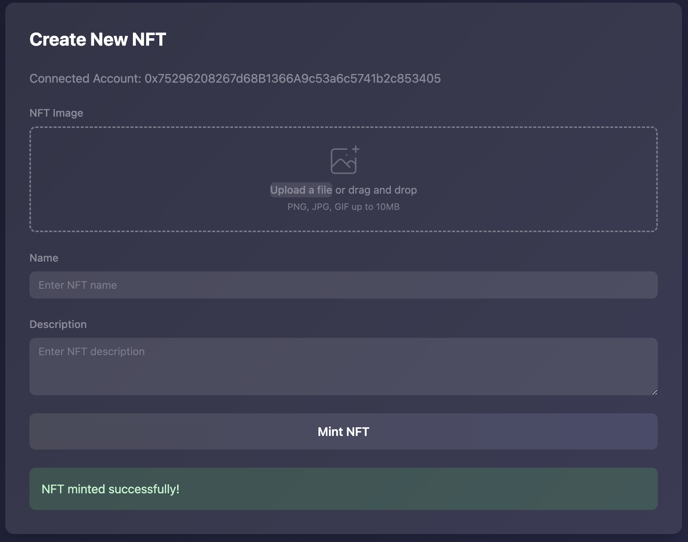

# NFTMinter

**Mint NFTs on Polkadot’s Westend Asset Hub with a simple UI and low fees.**
[Demo Video (with audio) – Loom](https://www.loom.com/share/dc5031794fcc4ad1b5633fcabfe69c94?sid=c52146b3-4f17-4191-b874-2654ff203794)

---

## 🌐 Summary

**NFTMinter** lets users mint NFTs on Polkadot's Westend Asset Hub using a simple web interface integrated with Polkadot.js. Fast, low-cost, and interoperable NFTs.

---

## 🧩 Full Description

NFTMinter solves a common challenge in the Web3 space: how to easily mint NFTs on a scalable, interoperable blockchain without incurring high gas fees. Built during our first Web3 hackathon, NFTMinter leverages Polkadot's **Westend Asset Hub** — a testnet version of the production-grade Asset Hub parachain — to provide a developer- and user-friendly minting experience. The project is designed for creators, developers, and hobbyists to experiment with NFT creation in a low-risk, cost-efficient environment.

By using Polkadot’s Substrate-based architecture and Ethereum-compatible parachains (like Moonbeam), NFTMinter benefits from cross-chain operability, shared security, and Polkadot's powerful on-chain governance model. Users interact with the platform using the Polkadot.js browser extension, ensuring secure and seamless wallet connectivity.

---

## ⚙️ Technical Description

### ✨ Key Technologies Used

* **Blockchain**: Polkadot (Westend Asset Hub, Moonbeam)
* **Smart Contract Language**: Solidity (compiled for Ethereum-compatible Moonbeam parachain)
* **Smart Contract**:
  * `NFTMinter.sol` – Custom ERC-721 NFT minting contract with URI metadata

* **Frontend**: HTML, JavaScript
* **Wallet Integration**: Polkadot.js API and Extension
* **Other Tools**: OpenZeppelin (ERC-721), Subscan Explorer, Loom for video

### 📌 Unique Polkadot Features Used

* **Westend Asset Hub** for safe, low-fee testing and development
* **Ethereum Compatibility** via Moonbeam for deploying Solidity contracts
* **XCM (Cross-Consensus Messaging)** for future NFT interoperability across chains
* **Polkadot.js Extension** for secure wallet integration and network switching

---

## 🧠 How the Smart Contracts Work

### `NFTMinter.sol`

* Inherits from `ERC721URIStorage` (OpenZeppelin)
* Mints NFTs with unique URIs on demand
* Written in Solidity and deployed to an Ethereum-compatible parachain (Moonbeam)
* Can be extended for advanced features like royalties, batch minting, etc.

## 🔗 Deployed Contracts

* **NFT Contract on Moonbase (EVM compatible)**:
  [https://moonbase.subscan.io/account/0x92fd6660B83F6a37A782A24385A9db5460c1D749]
  (https://moonbase.subscan.io/account/0x92fd6660B83F6a37A782A24385A9db5460c1D749)
* **Asset Hub Address (for XCM / Interoperability preview)**:
  [https://assethub-westend.subscan.io/account/0xF0Df800AB534A364414595D5F8aA1D6F73acE879]
  (https://assethub-westend.subscan.io/account/0xF0Df800AB534A364414595D5F8aA1D6F73acE879)
---

## 🎬 Demo Video

* **Full Video Walkthrough (with audio):**
  👉 [Loom Video](https://www.loom.com/share/dc5031794fcc4ad1b5633fcabfe69c94?sid=c52146b3-4f17-4191-b874-2654ff203794)

This video includes:

* Live minting demonstration
* Overview of the user interface
* How contracts are deployed and interacted with
* GitHub repo structure
* Explanation of how it meets hackathon requirements

---

## 📸 Screenshots

**Initial Page**


**After NFT Minting**


---

## 🧑‍💻 Canva Presentation

View the problem statement, solution design, and demo slides here:
👉 [Canva Slide Deck](http://canva.com/design/DAGl1f_BzdQ/zBtB3EAmwzmGxcG_eiB7SA/edit)

---

## 📁 GitHub Structure

```
NFTMinter/
│
├── contracts/
│   ├── NFTMinter.sol       # Custom ERC721 minting contract
│   └── Storage.sol         # Simple stateful contract
│
├── index.html              # Frontend UI
├── /screenshots            # UI screenshots
├── README.md               # This file
├── package.json
└── ...
```

---

## 🚀 Getting Started

### ✅ Prerequisites

* [Node.js and npm](https://nodejs.org/)
* [Polkadot.js Extension](https://polkadot.js.org/extension/)
* Westend (WND) testnet tokens — [Request from Faucet](https://polkadot.js.org/apps/?rpc=wss://westend-rpc.polkadot.io#/accounts)


## 📜 License

This project is **open-source** under the MIT License. All code will remain public.

---

## 👨‍💻 Authors

* Vijay Chelikani

---